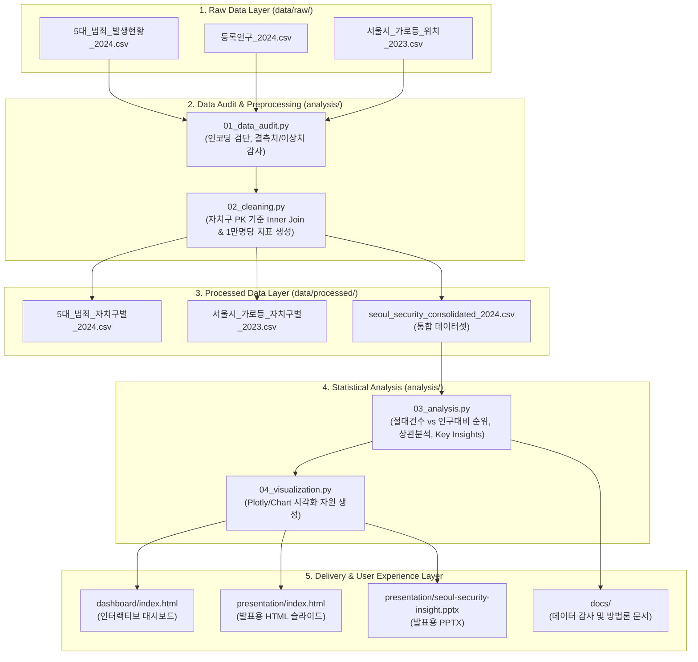
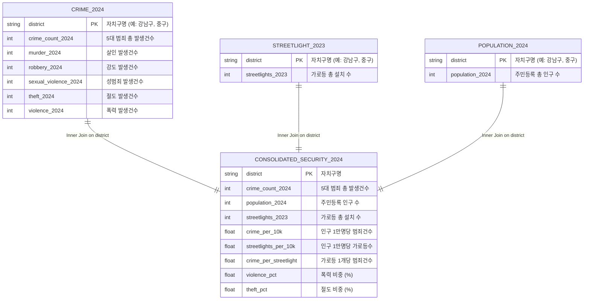

# 서울시 생활안전 데이터 흐름 및 데이터 관계 구조도 (Data Flow & ERD)

**문서 작성일자**: 2026년 8월 20일  
**대상 시스템**: 서울시 보안 인프라 분석 및 지도 기반 치안 정보 서비스

---

## 1. 시스템 데이터 파이프라인 구조도 (Data Processing Pipeline)

---

## 2. 데이터 관계 및 스키마 구조도 (Data Entity Relationship Diagram)

---

## 3. 리포지토리 구성과 데이터 흐름 매핑 Table

| 파이프라인 단계 | 실행 파일 / 소스 파일 | 주요 역할 및 출력물 |
|---|---|---|
| **1. 감사 (Audit)** | `analysis/01_data_audit.py` | CSV 데이터의 인코딩, 결측치, 이상치, 행/열 구조 점검 |
| **2. 정제 (Clean)** | `analysis/02_cleaning.py` | 자치구 PK 기준 Inner Join -> `seoul_security_consolidated_2024.csv` 생성 |
| **3. 분석 (Analysis)** | `analysis/03_analysis.py` | 절대/상대 순위, 피어슨 상관계수, 5대 범죄 비율 계산 -> `key_analysis_results.json` |
| **4. 시각화 (Visualization)** | `analysis/04_visualization.py` | 대시보드 및 발표용 차트 자원 및 HTML/PPTX 자원 통합 생성 |
| **5. 대시보드 (Dashboard)** | `dashboard/index.html` | 자치구/범죄유형 필터링, Hover Tooltip, 순위 정렬 인터랙티브 웹 UI |
| **6. 프레젠테이션 (Presentation)**| `presentation/index.html`, `.pptx` | 16:9 슬라이드, 스피커 노트를 지원하는 발표용 산출물 |
